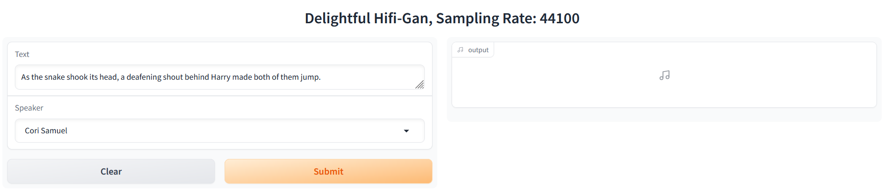

# TTS-Framework

[DelightfulTTS: The Microsoft Speech Synthesis System for Blizzard Challenge 2021](https://arxiv.org/abs/2110.12612)

<p align="center">
  <a href="https://pytorch.org/get-started/locally/"></a>
  <a href="https://lightning.ai/"></a>
  <a href="https://huggingface.co/spaces/peechapp/PeechTTSv22050"  style='padding-left: 0.5rem;'></a>
</p>

## Demo and weights

**Weights can be found inside the hf space.**


### DelightfulTTS + UnivNet, 22.05 khz, [check hf space demo PeechTTSv22050](https://huggingface.co/spaces/peechapp/PeechTTSv22050)

DelightfulTTS Weights: [epoch=5816-step=390418.ckpt](https://huggingface.co/spaces/peechapp/PeechTTSv22050/blob/main/epoch%3D5816-step%3D390418.ckpt)

Univnet Weights: [vocoder_pretrained.pt](https://huggingface.co/spaces/peechapp/PeechTTSv22050/blob/main/vocoder_pretrained.pt)

### DelightfulTTS + HifiGAN, 44.1 khz, [check hf space demo PeechTTSv44100](https://huggingface.co/spaces/peechapp/PeechTTSv44100)

DelightfulTTS Weights: [epoch=2450-step=183470.ckpt](https://huggingface.co/spaces/peechapp/PeechTTSv44100/blob/main/epoch%3D2450-step%3D183470.ckpt)

HifiGAN Weights: [epoch=19-step=44480.ckpt](https://huggingface.co/spaces/peechapp/PeechTTSv44100/blob/main/epoch%3D19-step%3D44480.ckpt)

## Run locally

### Install deps

```bash
sudo apt install ffmpeg libasound2-dev build-essential espeak-ng -y
```

Create env from the `environment.yml` file:

```bash
conda env create -f environment.yml

# After the setup
conda activate tts_framework

# Install torch
pip install --upgrade --force-reinstall --pre torch torchvision torchaudio --index-url https://download.pytorch.org/whl/nightly/cu121

# Install nemo
pip install nemo_toolkit['all']

# Run demo
python app.py
```

## Generate docs:

```
# live preview server
mkdocs serve

# build a static site from your Markdown files
mkdocs build
```

## Test cases:

```
python -m unittest discover -v
```
