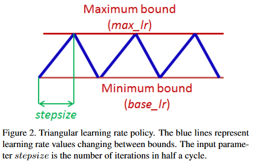

## Important! Effective Training Techniques

#### [More details are here: Effective Training Techniques](https://lightning.ai/docs/pytorch/stable/advanced/training_tricks.html)

Lightning implements various techniques to help during training that can help make the training smoother.

### Accumulate Gradients

TODO: check this approach

Accumulated gradients run `K` small batches of size `N` before doing a backward pass. The effect is a large effective batch size of size `KxN`, where `N` is the batch size. Internally it doesn’t stack up the batches and do a forward pass rather it accumulates the gradients for `K` batches and then do an `optimizer.step` to make sure the effective batch size is increased but there is no memory overhead.

> WARNING: When using distributed training for eg. DDP, with let’s say with `P` devices, each device accumulates independently i.e. it stores the gradients after each `loss.backward()` and doesn't sync the gradients across the devices until we call `optimizer.step()`. So for each accumulation step, the effective batch size on each device will remain `N*K` but right before the `optimizer.step()`, the gradient sync will make the effective batch size as `P*N*K`. For DP, since the batch is split across devices, the final effective batch size will be `N*K`.

```python
# DEFAULT (ie: no accumulated grads)
trainer = Trainer(accumulate_grad_batches=1)

# Accumulate gradients for 7 batches
trainer = Trainer(accumulate_grad_batches=7)
```

Optionally, you can make the accumulate_grad_batches value change over time by using the `GradientAccumulationScheduler`. Pass in a scheduling dictionary, where the key represents the epoch at which the value for gradient accumulation should be updated.

```python
from lightning.pytorch.callbacks import GradientAccumulationScheduler

# till 5th epoch, it will accumulate every 8 batches. From 5th epoch
# till 9th epoch it will accumulate every 4 batches and after that no accumulation
# will happen. Note that you need to use zero-indexed epoch keys here
accumulator = GradientAccumulationScheduler(scheduling={0: 8, 4: 4, 8: 1})
trainer = Trainer(callbacks=accumulator)
```

### Gradient Clipping

Gradient clipping can be enabled to avoid exploding gradients. By default, this will clip the gradient norm by calling `torch.nn.utils.clip_grad_norm_()` computed over all model parameters together. If the Trainer's `gradient_clip_algorithm` is set to `'value'` (`'norm'` by default), this will use instead `torch.nn.utils.clip_grad_value_()` for each parameter instead.

> If using mixed precision, the `gradient_clip_val` does not need to be changed as the gradients are unscaled before applying the clipping function.

```python
# DEFAULT (ie: don't clip)
trainer = Trainer(gradient_clip_val=0)

# clip gradients' global norm to <=0.5 using gradient_clip_algorithm='norm' by default
trainer = Trainer(gradient_clip_val=0.5)

# clip gradients' maximum magnitude to <=0.5
trainer = Trainer(gradient_clip_val=0.5, gradient_clip_algorithm="value")
```

### Stochastic Weight Averaging

### TODO: add this approach

Stochastic Weight Averaging (SWA) can make your models generalize better at virtually no additional cost. This can be used with both non-trained and trained models. The SWA procedure smooths the loss landscape thus making it harder to end up in a local minimum during optimization.

For a more detailed explanation of SWA and how it works, [read this post by the PyTorch team.](https://pytorch.org/blog/pytorch-1.6-now-includes-stochastic-weight-averaging/)

The `StochasticWeightAveraging` callback

```python
# Enable Stochastic Weight Averaging using the callback
trainer = Trainer(callbacks=[StochasticWeightAveraging(swa_lrs=1e-2)])
```

### Batch Size Finder

Auto-scaling of batch size can be enabled to find the largest batch size that fits into memory. Large batch size often yields a better estimation of the gradients, but may also result in longer training time. Inspired by https://github.com/BlackHC/toma.

```python
from lightning.pytorch.tuner import Tuner

# Create a tuner for the trainer
trainer = Trainer(...)
tuner = Tuner(trainer)

# Auto-scale batch size by growing it exponentially (default)
tuner.scale_batch_size(model, mode="power")

# Auto-scale batch size with binary search
tuner.scale_batch_size(model, mode="binsearch")

# Fit as normal with new batch size
trainer.fit(model)

```

Currently, this feature supports two modes `'power'` scaling and `'binsearch'` scaling. In `'power'` scaling, starting from a batch size of 1 keeps doubling the batch size until an out-of-memory (OOM) error is encountered. Setting the argument to `'binsearch'` will initially also try doubling the batch size until it encounters an OOM, after which it will do a binary search that will finetune the batch size. Additionally, it should be noted that the batch size scaler cannot search for batch sizes larger than the size of the training dataset.

> NOTE: This feature expects that a `batch_size` field is either located as a model attribute i.e. `model.batch_size` or as a field in your hparams i.e. `model.hparams.batch_size`. Similarly it can work with datamodules too. The field should exist and will be updated by the results of this algorithm. Additionally, your `train_dataloader()` method should depend on this field for this feature to work i.e.

```python
# using LightningModule
class LitModel(LightningModule):
    def __init__(self, batch_size):
        super().__init__()
        self.save_hyperparameters()
        # or
        self.batch_size = batch_size

    def train_dataloader(self):
        return DataLoader(train_dataset, batch_size=self.batch_size | self.hparams.batch_size)


model = LitModel(batch_size=32)
trainer = Trainer(...)
tuner = Tuner(trainer)
tuner.scale_batch_size(model)


# using LightningDataModule
class LitDataModule(LightningDataModule):
    def __init__(self, batch_size):
        super().__init__()
        self.save_hyperparameters()
        # or
        self.batch_size = batch_size

    def train_dataloader(self):
        return DataLoader(train_dataset, batch_size=self.batch_size | self.hparams.batch_size)


model = MyModel()
datamodule = LitDataModule(batch_size=32)

trainer = Trainer(...)
tuner = Tuner(trainer)
tuner.scale_batch_size(model, datamodule=datamodule)

```

> NOTE: Note that the `train_dataloader` can be either part of the `LightningModule` or `LightningDataModule` as shown above. If both the `LightningModule` and the `LightningDataModule` contain a `train_dataloader`, the `LightningDataModule` takes precedence.

> WARNING: Batch size finder is not yet supported for DDP or any of its variations, it is coming soon.

### Learning Rate Finder

### TODO: add this approach

> WARNING: For the moment, this feature only works with models having a single optimizer.
**It means I can't implement it for the `univnet` at this moment!**

For training deep neural networks, selecting a good learning rate is essential for both better performance and faster convergence. Even optimizers such as `Adam` that are self-adjusting the learning rate can benefit from more optimal choices.

To reduce the amount of guesswork concerning choosing a good initial learning rate, a learning rate finder can be used. As described in [this paper](https://arxiv.org/abs/1506.01186) a learning rate finder does a small run where the learning rate is increased after each processed batch and the corresponding loss is logged. The result of this is a `lr` vs. `loss` plot that can be used as guidance for choosing an optimal initial learning rate.

[Cyclical Learning Rates for Training Neural Networks](https://arxiv.org/abs/1506.01186)

The key ideas:

> #### 3.1. Cyclical Learning Rates
> The essence of this learning rate policy comes from the observation that increasing the learning rate might have a short term negative effect and yet achieve a longer term beneficial effect. This observation leads to the idea of letting the learning rate vary within a range of values rather than adopting a stepwise fixed or exponentially decreasing value. That is, one sets minimum and maximum boundaries and the learning rate cyclically varies between these bounds. Experiments with numerous functional forms, such as a triangular window (linear), a Welch window (parabolic) and a Hann window (sinusoidal) all produced equivalent results. This led to adopting a triangular window (linearly increasing then linearly decreasing), which is illustrated in Figure2, because it is the simplest function that incorporates this idea. The rest of this paper refers to this as the triangular learning rate policy.



#### Using Lightning’s built-in LR finder

To enable the learning rate finder, your lightning module needs to have a `learning_rate` or `lr` attribute (or as a field in your `hparams` i.e. `hparams.learning_rate` or `hparams.lr`). Then, create the `Tuner` via `tuner = Tuner(trainer)` and call `tuner.lr_find(model)` to run the LR finder. The suggested `learning_rate` will be written to the console and will be automatically set to your lightning module, which can be accessed via `self.learning_rate` or `self.lr`.

```python
from lightning.pytorch.tuner import Tuner


class LitModel(LightningModule):
    def __init__(self, learning_rate):
        super().__init__()
        self.learning_rate = learning_rate
        self.model = Model(...)

    def configure_optimizers(self):
        return Adam(self.parameters(), lr=(self.lr or self.learning_rate))


model = LitModel()
trainer = Trainer(...)

# Create a Tuner
tuner = Tuner(trainer)

# finds learning rate automatically
# sets hparams.lr or hparams.learning_rate to that learning rate
tuner.lr_find(model)
```

If your model is using an arbitrary value instead of `self.lr` or `self.learning_rate`, set that value in `lr_find`:

```python
model = LitModel()
trainer = Trainer(...)
tuner = Tuner(trainer)

# to set to your own hparams.my_value
tuner.lr_find(model, attr_name="my_value")
```

You can also inspect the results of the learning rate finder or just play around with the parameters of the algorithm. A typical example of this would look like:

```python
model = MyModelClass(hparams)
trainer = Trainer()
tuner = Tuner(trainer)

# Run learning rate finder
lr_finder = tuner.lr_find(model)

# Results can be found in
print(lr_finder.results)

# Plot with
fig = lr_finder.plot(suggest=True)
fig.show()

# Pick point based on plot, or get suggestion
new_lr = lr_finder.suggestion()

# update hparams of the model
model.hparams.lr = new_lr

# Fit model
trainer.fit(model)
```

The figure produced by `lr_finder.plot()` should look something like the figure below. It is recommended to not pick the learning rate that achieves the lowest loss, but instead something in the middle of the sharpest downward slope (red point). This is the point returned by `lr_finder.suggestion()`.


