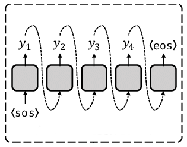
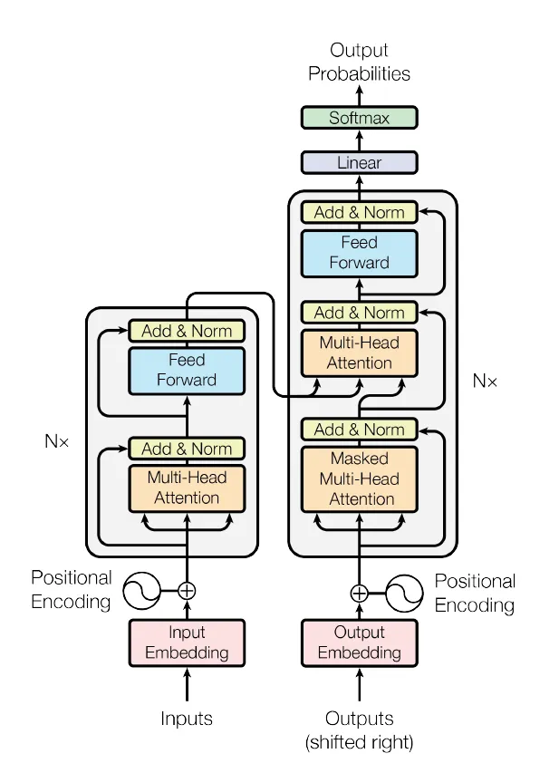
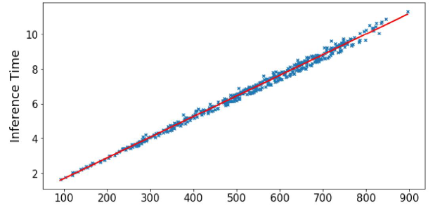
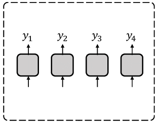
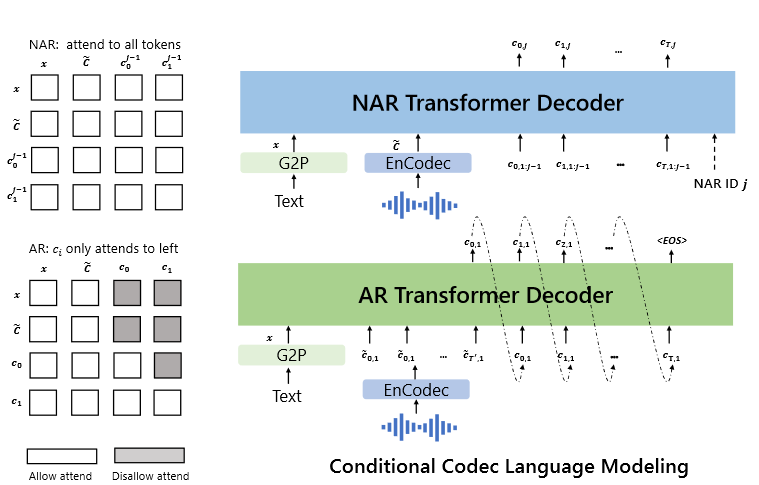
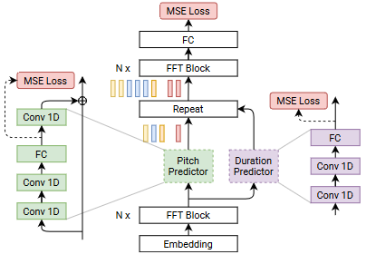
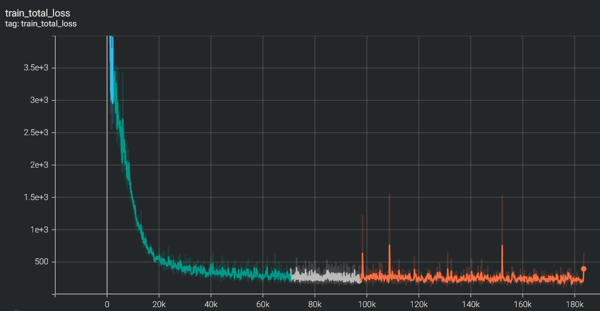

# Training Text-to-Speech Models: A Journey from Zero to...
Developing a high-quality text-to-speech (TTS) system is a complex task that requires extensive training of machine learning models. While successful TTS models can revolutionize how we interact with technology, enabling natural-sounding speech synthesis for various applications, the path to achieving such models is often paved with challenges and setbacks.
Training a TTS model from scratch is a challenging process that involves numerous steps, from data preparation and preprocessing to model architecture selection, hyperparameter tuning, and iterative refinement. Even with state-of-the-art techniques and powerful computational resources, it's not uncommon for initial training attempts to fall short of expectations, yielding suboptimal results or encountering convergence issues.
By carefully analyzing the shortcomings of unsuccessful models and identifying the root causes of their underperformance, researchers and practitioners can gain invaluable insights into the intricacies of TTS model training. These lessons can then inform and refine the training process, leading to more robust and high-performing models.
In this article, we embark on a comprehensive journey, exploring the intricate world of TTS models.

## How it all started?
At Peech, we're dedicated to making Text to Speech accessible to everyone - individuals and publishers alike. Our innovative technology converts web articles, e-books, and any written content into engaging audiobooks. This is especially beneficial for individuals with dyslexia, ADHD, or vision impairments, as well as anyone who prefers listening to reading.
The heart of our app lies in its text-to-speech technology. I've recently joined the impressive speech team with the ambition of advancing our capabilities in AI and Machine Learning. To achieve this, we've embarked on a research journey focused on training models in this domain.
I'm excited to share with you the results I've achieved in our research and model training. We have done a good job, and I'd like to present the accomplishments to you.

**Audio is a very complicated data structure, just take a look for a 1 sec waveform...**

|                                                                                                     |
| :------------------------------------------------------------------------------------------------------------------------------------------: |
| *Audio exhibits patterns at multiple time scales. Source: [Google DeepMind](https://deepmind.com/blog/wavenet-generative-model-raw-audio/).* |

## One-to-Many Mapping Problem in TTS
In TTS, the goal is to generate a speech waveform $y$ from a given input text $x$. This can be represented as a mapping function $f$ such that:

$$y = f(x)$$

However, the mapping from text to speech is not unique, as there can be multiple valid speech outputs $y$ for the same input text $x$. This is because speech is a complex signal that encodes various types of information beyond just the phonetic content, such as pitch, duration, speaker characteristics, prosody, emotion, and more.

Let's denote these additional factors as a set of variation parameters $v$. Then, the mapping function $f$ can be rewritten as:

$$y = f(x, v)$$

This means that for a given input text $x$, the speech output $y$ can vary depending on the values of the variation parameters $v$.
For example, consider the input text `x = "Hello, how are you?"`. Depending on the variation parameters $v$, we can have different speech outputs:
- If $v$ represents pitch contour, we can have a speech output with a rising pitch at the end (questioning tone) or a falling pitch (statement tone).
- If $v$ represents speaker identity, we can have speech outputs from different speakers, each with their unique voice characteristics.
- If $v$ represents emotion, we can have speech outputs conveying different emotions, such as happiness, sadness, or anger.
Mathematically, we can represent the variation parameters $v$ as a vector of different factors:

$$v = [v_{\text{pitch}}, v_{\text{duration}}, v_{\text{speaker}}, v_{\text{prosody}}, v_{\text{emotion}}, \dots]$$

The challenge in TTS is to model the mapping function $f$ in such a way that it can generate appropriate speech outputs $y$ for a given input text $x$ and variation parameters $v$. This is known as the one-to-many mapping problem, as there can be multiple valid speech outputs for the same input text, depending on the variation factors.
There are two main approaches to modeling the specific aspects of the variation parameters $v$:
1. **Modeling Individual Factors**: In this approach, each variation factor is modeled independently, without considering the interdependencies and interactions between different factors. For example, a model might focus solely on predicting pitch contours or duration values, treating them as separate components. While this approach can capture specific aspects of the variation parameters, it fails to model the variation information in a comprehensive and systematic way. The interdependencies between different factors, such as the relationship between pitch and prosody or the influence of speaker characteristics on duration, are not accounted for.
2. **Unified Frameworks for Modeling Multiple Factors**: Recent research has proposed unified frameworks that aim to model multiple variation factors simultaneously, capturing their complementary nature and enabling more expressive and faithful speech synthesis. In this approach, the TTS model is designed to jointly model and generate multiple variation factors, considering their interdependencies and interactions. For instance, a unified framework might incorporate modules for predicting pitch, duration, and speaker characteristics simultaneously, while also accounting for their mutual influences. Mathematically, this can be represented as a mapping function $f$ that takes the input text $x$ and generates the speech output $y$ by considering the combined effect of multiple variation parameters $v$:

$$y=f(x,v_{\text{pitch}},v_{\text{duration}},v_{\text{speaker}},v_{\text{prosody}},v_{\text{emotion}}, \dots)$$

By modeling the variation parameters in a unified and comprehensive manner, these frameworks aim to capture the complex relationships between different factors, enabling more expressive and faithful speech synthesis that better reflects the nuances and variations present in natural speech.
The unified approach to modeling variation parameters in TTS systems has gained traction in recent years, as it addresses the limitations of modeling individual factors independently and enables the generation of more natural and expressive speech outputs.

## Two sides of a coin: AR vs NAR
Any structured data can be transformed into a sequence. For instance, speech can be represented as a sequence of waveforms. Neural sequence generation methods can be used to generate such sequences, and there are two main categories of models for this purpose: autoregressive (AR) and non-autoregressive (non-AR) sequence generation methods.
*I believe, that any sequence can be generated using neural sequence generation methods (but not sure).*

### Autoregressive models
Autoregressive (AR) sequence generation involves generating a sequence one token at a time in an autoregressive manner. In an AR model, the current value in the sequence is predicted based on the previous values and an error term (often referred to as [white noise](https://en.wikipedia.org/wiki/White_noise), which represents the unpredictable or random component).

**The definition from wikipedia: [autoregressive model](https://en.wikipedia.org/wiki/Autoregressive_model):**
>In statistics, econometrics, and signal processing, an **autoregressive** (**AR**) **model** is a representation of a type of random process; as such, it is used to describe certain time-varying processes in nature, economics, behavior, etc. The autoregressive model specifies that the output variable depends linearly on its own previous values and on a [stochastic](https://en.wikipedia.org/wiki/Stochastic "Stochastic") term (an imperfectly predictable term); thus the model is in the form of a stochastic difference equation (or recurrence relation) which should not be confused with a [differential equation](https://en.wikipedia.org/wiki/Differential_equation "Differential equation").

The AR model's ability to capture sequential dependencies allows it to generate speech with natural-sounding variations, for example - making it expressive. This is because the model can learn to predict the next value in the sequence based on the context provided by the previous values.
**Autoregressive model of order $n$, denoted as $\text{AR}(n)$**, can be defined as:

$$x_t = b + \varphi_1x_{t-1} + \varphi_2x_{t-2} + \dots + \varphi_px_{t-n} + \epsilon_t$$

Using sum notation this can be written as:

$$x_t = b + \sum_{i=1}^n \varphi_i x_{t-i} + \varepsilon_t$$

where $b$ is the bias term, $x_t$ is the current value, $x_{t-1}, x_{t-2}, \ldots, x_{t-n}$ or $x_{t-i}$ are the $n$ previous values, $\varphi_1, \varphi_2, \dots , \varphi_n$ are the model parameters and $\varepsilon_t$ is the error term or the white noise.

During training, the model learns the optimal parameters $\varphi_1, \varphi_2, \ldots, \varphi_n$ by minimizing a loss function, such as the **Mean Squared Error (MSE)**:

$$L(\varphi) = \frac{1}{n} \sum_{i=1}^n (x_i - \hat{x_i})^2$$

where $x_i$ is the true value, $\hat{x_i}$ is the predicted value, and $n$ is the total number of time steps.

### Probabilistic Perspective
To define AR Sequence Generation in a probabilistic manner, we can use the chain rule to decompose the joint probability of the sequence into a product of conditional probabilities. 
AR sequence generation can be formulated using the chain rule of probability. Let $x = (x_1, x_2, \ldots, x_n)$ be the true sequence of length $n$.

$$P(x) = P(x_1, x_2, ..., x_n)$$

The joint probability of the sequence can be decomposed into a product of conditional probabilities:

$$P(x) = P(x_1, x_2, ..., x_n) = P(x_1)P(x_2 | x_1)P(x_3 | x_1, x_2) \dots P(x_n | x_1, x_2 \dots, x_{n-1})$$

Using prod notation this can be written as:

$$P(x) = \prod_{i=1}^nP(x_i|x_1,x_2,\dots,x_{i-1})$$

We can simplify the result to:

$$P(x) = \prod_{i=1}^nP(x_i|\mathbf{x}_{<i})$$

### Inference
During inference, the model generates the sequence one token at a time, using the previously predicted tokens as input:

$$\hat{x}_t = f(\hat{x}_{t-1}, \dots, \hat{x}_{t-n})$$

where $f$ is the AR model, and $\hat{x}_{t-1}, \hat{x}_{t-2}, \ldots, \hat{x}_{t-n}$ are the previously predicted tokens. 

Using sum notation and AR model definition this can be written as:

$$\hat{x}_t = b + \sum_{i=1}^n \varphi_i \hat{x}_{t-i}$$

### AR model schema
Note: oversimplified schema, shouldn't be considered seriously. SOS - start of the sequence, EOS - end of the sequence.



### The best example of the AR world: Transformer & LLM
Transformers, which are the backbone of many state-of-the-art natural language processing (NLP) and speech models, including Large Language Models (LLMs), use a mechanism called **self-attention** to model relationships between all pairs of tokens in a sequence. Self-attention allows the model to capture long-range dependencies and weigh the importance of each token relative to others, enabling it to focus on the most relevant tokens when generating the next token.
The attention mechanism in Transformers can be thought of as a weighted sum of the input tokens, where the weights represent the importance or relevance of each token for the current prediction. This allows the model to selectively focus on the most relevant tokens when generating the output.

Mathematically, the attention mechanism can be represented as $QKV$ **attention**:

$$\text{Attention}(Q,K,V) = \text{softmax}(\frac{QK^T}{\sqrt{d_k}})V$$

where:
- $Q$ (Query) represents the current token or context for which we want to find relevant information.
- $K$ (Key) and $V$ (Value) represent the input tokens and their corresponding values or representations.
- $d_k$ is the dimensionality of the key vectors, and the scaling factor $\sqrt{d_k}$ is used for numerical stability.
- The softmax function is applied to the scaled dot-product of the query and key vectors, resulting in a set of weights that sum to 1. These weights determine the relative importance of each input token for the current prediction.
- The weighted sum of the value vectors, $V$, is then computed using the attention weights, producing the final output of the attention mechanism.

#### Schema:


The self-attention mechanism in Transformers allows the model to capture dependencies between tokens in a sequence, regardless of their position or distance. This has made Transformers highly effective for various natural language processing tasks, including language modeling, machine translation, and text generation.

## Cons of Autoregressive (AR) models
While the autoregressive nature of AR models allows them to capture sequential dependencies and generate expressive sequences, it also introduces a significant drawback: slow inference time, especially for long sequences.

### Time Complexity Analysis
The time complexity of an algorithm or model refers to how the computational time required for execution scales with the input size. In the case of AR models, the input size is the sequence length, denoted as $n$.
During inference, AR models generate sequences one token at a time, using the previously generated tokens to predict the next token. This sequential generation process means that the model needs to process each token in the sequence, resulting in a time complexity of $O(n)$. In other words, the inference time grows linearly with the sequence length.
This linear time complexity can become a significant bottleneck in real-time scenarios or when dealing with long sequences, such as generating long texts, speech utterances, or high-resolution images. Even with modern hardware and parallelization techniques, the sequential nature of AR models can make them computationally expensive and slow for certain applications.
The slow inference time of AR models can be particularly problematic in the following scenarios:
1. **Real-time speech synthesis**: In applications like virtual assistants or text-to-speech systems, the ability to generate speech in real-time is crucial for a seamless user experience. AR models may struggle to keep up with the required speed, leading to noticeable delays or latency.
2. **Long-form text generation**: When generating long texts, such as articles, stories, or reports, the inference time of AR models can become prohibitively slow, making them impractical for certain use cases.
While AR models excel at capturing sequential dependencies and generating expressive sequences, their slow inference time can be a significant limitation in certain applications, especially those requiring real-time or low-latency performance or involving long sequences.

One of the inherent challenges in autoregressive (AR) models is the unavoidable loss of quality for longer sequences. This issue is visually represented in the following plot:



As you can see, the dispersion or spread of the predicted values increases as the sequence length grows. This phenomenon occurs by design in AR models, and it's crucial to understand the underlying reasons behind it.

### Harmful Biases in Autoregressive (AR) Generation
Autoregressive (AR) models are prone to several harmful biases that can negatively impact their performance and the quality of the generated sequences. These biases can arise from various factors, including the training process, the model architecture, and the nature of the data itself. Let's explore the reasons behind these, why do we have such kind of troubles?

### Error Propagation
Error propagation occurs when errors in the predicted tokens accumulate and affect the subsequent tokens, leading to a compounding effect, where the errors in the early tokens propagate to the later tokens. This can cause the generated sequence to deviate significantly from the true sequence, especially for longer sequences.

For example, the model predicts a sequence of length $n$, denoted as

$$\mathbf{\hat{x}_n} = (x̂_{t-1}, x̂_{t-2}, \dots, x̂_{t-n})$$

Each predicted token $\hat{x}_t$ is computed based on the previous predicted tokens:

$$\hat{x}_t = \varphi_1\hat{x}_{t-1} + \varphi_2\hat{x}_{t-2} + \dots + \varphi_p\hat{x}_{t-n} + b = \sum_{i=1}^n \varphi_i\hat{x}_{t-i} + b$$

Suppose the model predicts a token $\hat{x}_{t-i}$ with an error $\epsilon_{t-i}$.  The next token will be predicted based on the erroneous token $\hat{x}_{t-i}$, leading to a new error. This process continues, and the errors accumulate, leading to a significant deviation from the true sequence.
We can define this error propagation as:

$$\hat{x}_t = (\varphi_1\hat{x}_{t-1} + \epsilon_{t-1}) + (\varphi_2\hat{x}_{t-2} + \epsilon_{t-2}) + \dots + (\varphi_p\hat{x}_{t-n} + \epsilon_{t-n}) + b$$

Adding the growing error as a separated sum helps to visualize the harmful impact of the error propagation term:

$$\hat{x}_t = \sum_{i=1}^n \varphi_i\hat{x}_{t-i} + \sum_{i=1}^n \epsilon_{t-i} + b$$

The second term, $\sum_{i=1}^n \epsilon_{t-i}$, represents the accumulated error propagation term, which grows as the sequence length increases.
**Error-propagation term:** 

$$\text{err} = \sum_{i=1}^n \epsilon_{t-i}$$ 

**The worst-case scenario occurs when the error happens on the first token in the sequence, $\hat{x}_1$.** In this case, the error propagates and accumulates through the entire sequence, leading to the maximum deviation from the true sequence.

In the context of text-to-speech synthesis, error propagation can lead to the generation of random noise or artifacts in the synthesized audio, making it difficult to avoid and potentially resulting in an unnatural or distorted output.

### Label Bias
Label bias occurs when the normalization constraint over the vocabulary items at each decoding step in AR models leads to learning miscalibrated distributions over tokens and sequences. This can happen because the model is forced to assign probabilities that sum to 1 over the entire vocabulary, even if some tokens or sequences are highly unlikely or impossible in the given context.

Mathematically, the probability distribution over the vocabulary items at time step $t$ is typically computed using a softmax function:

$$p(x_t | x_{t-1}, \dots, x_{t-n}) = \text{softmax}(W x_{t-1} + \dots + W x_{t-n} + b)$$

where $p(x_t | x_{t-1}, ..., x_{t-n})$ is the probability distribution over the vocabulary items, $W$ is the weight matrix, and $b$ is the bias term.
This normalization constraint can lead to a bias towards certain tokens or sequences, even if they are unlikely or irrelevant in the given context. For example, consider a language model trained on a corpus of news articles. If the model encounters a rare or unseen word during inference, it may still assign a non-zero probability to that word due to the normalization constraint, even though the word is highly unlikely in the context of news articles.

The consequences of label bias can be significant, especially in cases where the data distribution is highly skewed or contains rare or unseen events. It can lead to the generation of nonsensical or irrelevant tokens, which can degrade the overall quality and coherence of the generated sequences. This bias can be particularly problematic in applications such as machine translation, text summarization, or dialogue systems, where accurate and context-appropriate generation is crucial.

### Order Bias

Order bias occurs when the left-to-right generation order imposed by AR models is not the most natural or optimal order for the given task or data. In some cases, the data may prefer a different generation order or require considering the entire context simultaneously, rather than generating tokens sequentially.

For example, in text-to-speech synthesis, the natural flow of speech may not follow a strict left-to-right order. The pitch, intonation, or emphasis of a sentence can be determined by the context of the entire sentence, rather than the individual words. If the model is trained to generate the audio sequence in a left-to-right order, it may fail to capture these nuances, leading to an unnatural or strange-sounding output.

## Non-autoregressive models (NAR)
Non-autoregressive (NAR) sequence generation is an alternative approach to autoregressive (AR) models, where the entire output sequence is generated in parallel, without relying on previously generated tokens. Unlike AR models, which generate the sequence one token at a time in an autoregressive manner, NAR models do not have any sequential dependencies during the generation process. The key advantage of NAR models is their computational efficiency and speed. By generating the entire sequence in a single pass, NAR models can significantly reduce the inference time compared to AR models, which can be particularly beneficial for applications that require real-time or low-latency performance.

### Time Complexity Analysis
The time complexity of NAR models is constant, denoted as $O(1)$, as the generation of the entire sequence is performed in a single pass, regardless of the sequence length. This is in contrast to AR models, which have a linear time complexity or $O(n)$.

### Definition
Here is how we can define the non-autoregressive model:

$$x_t = f(x, t)$$

where $f$ is the NAR model, $x$ is the input sequence, and $t$ is the time step.

In a non-autoregressive model, the output sequence is generated in a single pass, without any sequential dependencies. This can be represented mathematically as:

$$\hat{x} = f(x)$$

where $x$ is the input sequence, $f$ is the NAR model and $\hat{x}$ is the output sequence.

To define NAR Sequence Generation in a probabilistic manner, we can use the product rule to decompose the joint probability of the sequence into a product of independent probabilities.

**NAR Sequence Generation as a Probabilistic Model:** Let's denote the sequence of tokens as $x = (x_1, x_2, \dots, x_n)$, where $n$ is the sequence length. We can model the joint probability of the sequence using the product rule:

$P(x) = P(x_1)P(x_2) \dots P(x_n) = \prod_{i=1}^nP(x_i)$

Note that in a non-autoregressive model, the probability of each token is independent of the previous tokens, in contrast to AR models, which model the conditional probabilities using the chain rule.

### NAR model schema
Note: over-oversimplified schema, shouldn't be considered seriously at all. Shows that every token is independent.



## Cons of NAR models
NAR models generate each token independently, without considering the context of the previous tokens, models do not capture sequential dependencies between tokens, which can result in generated sequences that do not follow the natural flow of language. **The independence assumption in the output space ignores the real dependency between target tokens**. NAR models are not well-suited to capture hierarchical structures in language, such as syntax and semantics. 
Based on the nature NAR models may generate repetitive phonemes or sounds, leading to a lack of naturalness and coherence in the synthesized speech, models may generate shorter or broken utterances, failing to capture the full meaning or context of the input text. NAR models may generate speech that sounds unnatural or robotic, indicating a lack of understanding of the acoustic properties of speech, and also may struggle to capture long-range dependencies between tokens, leading to a lack of coherence and fluency in the generated sequence.

### Text-to-Speech Non-Autoregressive models
Despite their limitations, Non-Autoregressive (NAR) models are still widely used in Text-to-Speech (TTS) systems. One of the main advantages of NAR models is their ability to generate speech much faster than Autoregressive (AR) models, thanks to their reduced computational requirements. This makes them well-suited for real-time TTS applications where speed is crucial. While NAR models may not produce speech that is as natural-sounding as AR models, they can still generate high-quality speech that is sufficient for many use cases.

#### Side-by-side AR / NAR


To enhance the quality of the synthesized audio in non-autoregressive (NAR) text-to-speech models, researchers have explored the idea of incorporating additional modules or blocks to predict various speech parameters. By explicitly modeling speech parameters, such as pitch, energy, and other prosodic features, the models can generate more expressive and natural-sounding speech.

For instance, in the FastPitch model, a dedicated pitch predictor module is introduced to generate pitch contours in parallel, which are then used to condition the mel-spectrogram generation.

#### Schema of FastSpeech:


While introducing additional modules and conditioning the generation process on various speech parameters can improve the quality of the synthesized audio, it is important to strike a balance between model complexity and computational efficiency. The non-autoregressive nature of these models is designed to achieve faster inference speeds compared to autoregressive models, and adding too many complex modules or dependencies could potentially negate this advantage.

## Mostly adequate TTS models review
In the following sections, I will review the most interesting implementations and key ideas in the field of non-autoregressive (NAR) text-to-speech models. It's important to note that not all models have published research papers or open-source code available. However, I will endeavor to uncover and present the relevant information and insights from the available sources.

## AR and hybrid models

## SunoAI Bark
My research has begun with the discovery of an incredible open-source solution that can produce incredible results: [SunoAI Bark](https://github.com/suno-ai/bark)

Bark is obviously AR model, but how it works? I found this great repo: [audio-webui](https://github.com/gitmylo/audio-webui) and author tried to found out [how bark works](https://github.com/gitmylo/audio-webui/wiki/how-bark-works#implementations--in-chronological-order-), but:
>## 📓 Note
>I'm still unsure how bark works. I am trying to figure out how it works though. My current knowledge goes here.

The author is researching voice cloning using the SunoAI Bark model and identified three different models used in the generation process: Semantics, Coarse, and Fine. The author notes that the current method of generating semantic tokens is problematic, as it generates tokens based on the input text rather than the actual audio.

The author proposes three potential way for creation of speaker files for voice cloning:
1. Find out how Bark generates semantic tokens (may not be publicly available).
2. Train a neural network to convert audio files to semantic tokens (time-consuming, but effective).
3. Use a speech converter to change the input audio without editing semantics (not perfect, but better than current methods).

The author has implemented Method 3 using coqui-ai/TTS and achieved decent voice cloning results, but with limitations. 

>**Results**: Decent voice cloning, not near perfect though. Better than previous methods, but struggles with some voices and accents. These issues lie in the transfer step.

They also explored Method 1, but were unable to find a suitable model. 

>**Pre**: It looks like bark uses [AudioLM](https://github.com/lucidrains/audiolm-pytorch) for the semantic tokens! I'm not sure if they use a different model though. I'll have to test that. But if they don't use a pre-trained model. I can do step 2.
>**Results**: No, it doesn't look like i can find a model, i did succeed in creating same-size vector embeddings, but the vectors use the wrong tokens.

Method 2, which involves creating a quantizer based on data, has shown promising results, achieving convincing voice cloning with some limitations.

>**Pre**: What if instead of training a whole model, i only create a quantizer based on a bunch of data?
>**Results**: Successful voice cloning, can be very convincing. Still some limitations. But better than anything I've seen done with bark before.

I can't tell you more, please, share any details if you find better explanations of the Bark. AR nature of the model is obvious, that's for sure. I faced with the limitations from the first touch - model can't generate audio more than 13-14 sec length.
Several issues about this problem are here:
* [Limited to 13 seconds?](https://github.com/suno-ai/bark/issues/79)
* [Arbitrarily long text](https://github.com/suno-ai/bark/issues/21)

Comment about it from issue [\#36 Inquiry on Maximum input character text prompt Length](https://github.com/suno-ai/bark/issues/36):

> right now the output is limited by the context window of the model (1024) which equates to about 14s. So text should be around that duration (meaning ~2-3 sentences). For longer texts you can either do them one at a time (and use the same history prompt to continue the same voice) or feed the first generation as the history for the second. i know that that's still a bit inconvenient. will try to add better support for that in the next couple of days

You can implement the following [approach](https://github.com/suno-ai/bark/pull/84#issuecomment-1523433448), split sentences and synthesize the audio chunks:
```python
from bark import generate_audio,preload_models
from scipy.io.wavfile import write as write_wav
import numpy as np
import nltk

nltk.download('punkt')
preload_models()

long_string = """
Bark is a transformer-based text-to-audio model created by [Suno](https://suno.ai/). Bark can generate highly realistic, multilingual speech as well as other audio - including music, background noise and simple sound effects. The model can also produce nonverbal communications like laughing, sighing and crying. To support the research community, we are providing access to pretrained model checkpoints ready for inference.
"""

sentences = nltk.sent_tokenize(long_string)

# Set up sample rate
SAMPLE_RATE = 22050
HISTORY_PROMPT = "en_speaker_6"

chunks = ['']
token_counter = 0

for sentence in sentences:
	current_tokens = len(nltk.Text(sentence))
	if token_counter + current_tokens <= 250:
		token_counter = token_counter + current_tokens
		chunks[-1] = chunks[-1] + " " + sentence
	else:
		chunks.append(sentence)
		token_counter = current_tokens

# Generate audio for each prompt
audio_arrays = []
for prompt in chunks:
    audio_array = generate_audio(prompt,history_prompt=HISTORY_PROMPT)
    audio_arrays.append(audio_array)

# Combine the audio files
combined_audio = np.concatenate(audio_arrays)

# Write the combined audio to a file
write_wav("combined_audio.wav", SAMPLE_RATE, combined_audio)
```

Also you can use batching:
```python
from IPython.display import Audio

from transformers import AutoProcessor
from transformers import BarkModel

model = BarkModel.from_pretrained("suno/bark-small")
processor = AutoProcessor.from_pretrained("suno/bark-small")

text_prompt = [
    "Let's try generating speech, with Bark, a text-to-speech model",
    "Wow, batching is so great!",
    "I love Hugging Face, it's so cool."
]

inputs = processor(text_prompt).to(device)

with torch.inference_mode():
  # samples are generated all at once
  speech_output = model.generate(**inputs, do_sample = True, fine_temperature = 0.4, coarse_temperature = 0.8)

# let's listen to the output samples!

Audio(speech_output[2].cpu().numpy(), rate=sampling_rate)
```

But the butch generation creates a new problem. The quality of the audio is dramatically reduced, and it generates strange noises, much more often than in the case of generation in order. I found a great description in the comment: [output quality seems worse if you pack it like that](https://github.com/suno-ai/bark/issues/21#issuecomment-1516990620)
One more problem that I found is empty sounds if your text chunks are different sizes. Sometimes it's a random noise like background voices etc. So, you need to split the text carefully, it's very important.
Bark occasionally hallucinates, which can lead to unexpected and inaccurate results. Unfortunately, it is impossible to detect this issue during the generation process, making it challenging to identify and correct. Furthermore, even during the review process, hallucinations can be difficult to spot, as they may be subtle or blend in with the rest of the generated content. This can result in incorrect or misleading information being presented as factual, which can have serious consequences in certain applications.

### SunoAI summary 
From what I understand, the issue of long context is not a priority for the Bark team and is largely being overlooked in the issues discussion. The only solution they've proposed is to use batches, but this approach has its limitations and doesn't work well. Moreover, due to the text context, it can't be processed accurately. Specifically, a small context of 2-3 sentences tends to disregard what happened in the previous passage, which can significantly impact the intonation and tempo of a speaker. Bark occasionally hallucinates, which can lead to unexpected and inaccurate results.

## VALL-E: Neural Codec Language Models are Zero-Shot Text to Speech Synthesizers
Samples on the [demo page](https://www.microsoft.com/en-us/research/project/vall-e-x/).

VALL-E is a novel language model approach for text-to-speech (TTS) synthesis that leverages large-scale, diverse, and multi-speaker speech data. Unlike traditional cascaded TTS systems, VALL-E treats TTS as a conditional language modeling task, using discrete audio codec codes as intermediate representations. This approach enables VALL-E to synthesize high-quality, personalized speech with only a 3-second enrolled recording of an unseen speaker as an acoustic prompt.

**Key Components:**
1. **Neural Codec Model**: VALL-E uses a pre-trained neural audio codec model, [EnCodec](https://github.com/facebookresearch/encodec), to convert audio waveforms into discrete acoustic codes. This model is trained on a large dataset of speech and can reconstruct high-quality waveforms even for unseen speakers.
2. **Language Model**: VALL-E is trained as a language model, using the discrete acoustic codes as input and output. This allows the model to learn the patterns and structures of speech, enabling it to generate coherent and natural-sounding speech.
3. **In-Context Learning**: VALL-E has strong in-context learning capabilities, similar to GPT-3, which enables it to adapt to new speakers and acoustic environments with minimal additional training data.

### The Problem Formulation is valid for Bark as well (except dimensions):
**Problem Formulation: Regarding TTS as Conditional Codec Language Modeling**
Given a dataset $D = \{x_i, y_i\}$, where $y$ is an audio sample and $x = \{x_0, x_1, \dots, x_L\}$ is its corresponding phoneme transcription, we use a pre-trained neural codec model to encode each audio sample into discrete acoustic codes, denoted as $\text{Encodec}(y) = C^{T ×8}$, where $C$ represents the two-dimensional acoustic code matrix, and $T$ is the downsampled utterance length. The row vector of each acoustic code matrix $c_{t,:}$ represents the eight codes for frame $t$ and the column vector of each acoustic code matrix $c_{:,j}$ represents the code sequence from the $j$-th codebook, where $j \in \{1, \dots, 8\}$. After quantization, the neural codec decoder is able to reconstruct the waveform, denoted as $\text{Decodec}(C) ≈ \hat{y}$.



**Based on the paper, it appears that the proposed model combines the principles of Autoregressive (AR) and Non-Linear Autoregressive (NAR) models:**
> The combination of the AR model and the NAR model provides a good trade-off between speech quality and inference speed. On the one hand, the rate of the generated speech should be consistent with the enrolled recording, and it is hard to train a length predictor for different speakers since their speaking speed may be very diverse. In this case, the AR model is a more natural choice with its flexibility for acoustic sequence length prediction. On the other hand, for the consecutive stages, as the number of output slots follows the sequence length of the first stage, NAR can reduce the time complexity from $O(T)$ to $O(1)$. Overall, the prediction of $C$ can be modeled as:
> $p(C|x, \tilde{C}; \theta) = p(c_{:,1}| \tilde{C}_{:,1}, X; \theta_{\text{AR}}) \prod_{x=2}^8 p(c_{:,j}|c_{:,<j}, x, \tilde{C}; \theta_{\text{NAR}})$

### VALL-E implementations
Note that there is currently no official implementation of VALL-E available. Even ETA for the official release is unknown [VALL-E ETA?](https://github.com/microsoft/unilm/issues/977). The [official repository](https://github.com/microsoft/unilm/tree/master/valle) currently contains an empty space, awaiting further updates. However, for those interested in experimenting with VALL-E, an unofficial PyTorch implementation is available at [unofficial PyTorch implementation of VALL-E](https://github.com/lifeiteng/vall-e). This implementation can be trained on a single GPU and is widely used in the community.

[After eight hours of training, the model can synthesize natural speech!](https://github.com/lifeiteng/vall-e/issues/53)
>code branch `position` PR [#46](https://github.com/lifeiteng/vall-e/pull/46)  
>egs `https://github.com/lifeiteng/vall-e/tree/position/egs/ljspeech`
>synthesised speech [https://github.com/lifeiteng/vall-e/tree/position/egs/ljspeech/demos](https://github.com/lifeiteng/vall-e/tree/position/egs/ljspeech/demos)
>The next step is to verify `in-context learning capabilities` of VALL-E on a large dataset.

And I found one more training story: [After 100 epochs training, the model can synthesize natural speech on LibriTTS](https://github.com/lifeiteng/vall-e/issues/58)

> I trained vall-e on LibriTTS about 100 epochs (took almost 4 days on 8 A100 GPUs) and I obtained plausible synthesized audio.
> 
> Here is a demo.
> 
> [1] prompt : [prompt_link](https://drive.google.com/file/d/149pHqb6TZzVwhF1vRN50H8A4AEYShpfp/view?usp=share_link)  synthesized audio : [synt_link](https://drive.google.com/file/d/189MpDf7f3nL-RfO3MtgtQ0APuwRygA0M/view?usp=share_link)
> [2] prompt : [prompt_link](https://drive.google.com/file/d/149pHqb6TZzVwhF1vRN50H8A4AEYShpfp/view?usp=share_link)  ground truth : [gt_link](https://drive.google.com/file/d/1rfsQD11Dtp7bzng73qGTU7H_YKSdeOdZ/view?usp=share_link)  synthesized audio : [synt_link](https://drive.google.com/file/d/1Y4llFLT3Z8proFU_HeasRYGj656pLtcm/view?usp=share_link)
> [3] prompt : [prompt_link](https://drive.google.com/file/d/1N9EqA1GWJOBIZbjqpHidrEJs6sGtVuyu/view?usp=share_link)  synthesized audio : [synt_link](https://drive.google.com/file/d/1-W8QnhliE5UcFx8fn8B20KRlls5LGfiT/view?usp=share_link)
> [4] prompt : [prompt_link](https://drive.google.com/file/d/1N9EqA1GWJOBIZbjqpHidrEJs6sGtVuyu/view?usp=share_link)  ground truth : [gt_link](https://drive.google.com/file/d/1EIz686OEQ4-zep_JSN_WKriSIFiwz-Xc/view?usp=share_link)  synthesized audio : [synt_link](https://drive.google.com/file/d/1z9EUcQdSf4QD_8KH3mcZpAdRMZZW9XpH/view?usp=share_link)
> 
> The model I trained has worse quality than the original vall-e because of the dataset amount. However, it has promising quality in clean audio. I'm not sure whether I can share my pre-trained LibriTTS model. If I can, I would like to share the pre-trained LibriTTS model.

Model weights:
>Sorry for late reply. This is the model that I trained. 
>google drive link : [link](https://drive.google.com/file/d/1pKvS56NnzVCYqhbjoFqL_JQ8i32UixbL/view?usp=sharing)

One more unofficial PyTorch implementation of [VALL-E](https://github.com/enhuiz/vall-e), based on the [EnCodec](https://github.com/facebookresearch/encodec) tokenizer.

### VALL-E summary
So, VALL-E is an AR or NAR model? VALL-E is a hybrid model that leverages the strengths of both AR and NAR architectures.

In section *6 Conclusion, Limitations, and Future Work* you can see one important note:
> **Synthesis robustness:** We observe that some words may be unclear, missed, or duplicated in
> speech synthesis. It is mainly because the phoneme-to-acoustic language part is an autoregressive model, in which disordered attention alignments exist and no constraints to solving the issue. The phenomenon is also observed in vanilla Transformer-based TTS, which was addressed by applying non-autoregressive models or modifying the attention mechanism in modeling. In the future, we would like to leverage these techniques to solve the issue.

It's interesting to note that the authors acknowledge this limitation and plan to explore techniques from non-autoregressive models or modified attention mechanisms to address this issue in future work. Even state-of-the-art AR models struggle with limitations like disordered attention alignments, leading to synthesis robustness issues.

## StyledTTS 2: Towards Human-Level Text-to-Speech through Style Diffusion and Adversarial Training with Large Speech Language Models

[Github repo](https://github.com/yl4579/StyleTTS2)
StyleTTS 2 is a state-of-the-art text-to-speech (TTS) model that leverages style diffusion and adversarial training with large speech language models (SLMs) to achieve human-level TTS synthesis.
By modeling styles as a latent random variable through diffusion models, StyleTTS 2 is able to generate the most suitable style for the input text in diverse speech synthesis. The use of large pre-trained SLMs, such as WavLM, as discriminators with differentiable duration modeling enables end-to-end training and improves speech naturalness.

### Style Diffusion
StyleTTS 2 models speech $x$ as a conditional distribution $p(x|t) = \int p(x|t, s)p(s|t) \mathrm{d}s$, where $t$ represents the phonetic content, and $s$ is a latent variable representing the generalized speech style. This style variable $s$ is sampled using Efficient Diffusion Models (EDM), which follow the combined probability flow and time-varying Langevin dynamics. By modeling styles as a latent random variable through diffusion models, StyleTTS 2 can generate the most suitable style for the input text, enabling diverse speech synthesis.

### Adversarial Training with Large SLMs
StyleTTS 2 employs large pre-trained SLMs, such as WavLM, as discriminators during training. This adversarial training, combined with the proposed differentiable duration modeling, results in improved speech naturalness.


### Key Contributions
1. **Differentiable Upsampling and Fast Style Diffusion**: StyleTTS 2 introduces a differentiable upsampling method that allows for generating speech samples during training in a fully differentiable manner, similar to inference. These generated samples are used to optimize the loss function involving the large pre-trained SLM, enabling end-to-end training of all components.
2. **Efficient Style Sampling**: To enable fast style sampling during inference, StyleTTS 2 uses the ancestral DPM-2 solver instead of the 2nd-order Heun method, allowing for fast and diverse sampling without significantly impacting inference speed.
3. **Multispeaker Modeling**: For multispeaker settings, StyleTTS 2 models $p(s|t, c)$, where $c$ is a speaker embedding obtained from a reference audio of the target speaker. This speaker embedding is injected into the transformer model using adaptive layer normalization.

### Known Issues
It's worth noting that StyleTTS 2 has a known issue where loud white noise can occur on short texts when the `embedding_scale` parameter is set to a value greater than 1 (see [GitHub issue #46](https://github.com/yl4579/StyleTTS2/issues/46)).

### Hybrid AR-NAR Approach perspective
StyleTTS 2 presents a novel and promising approach to text-to-speech synthesis by combining the strengths of both autoregressive (AR) and non-autoregressive (NAR) models. This hybrid architecture leverages the power of large pre-trained SLMs, which are typically autoregressive models, while incorporating the diversity and expressiveness offered by diffusion models, which are non-autoregressive. By combining the pre-trained SLM with the style diffusion process, StyleTTS 2 effectively creates a hybrid architecture that combines the strengths of both AR and NAR models. The SLM provides a strong foundation for capturing sequential dependencies and generating high-quality speech, while the diffusion process introduces diversity and expressiveness, enabling the generation of natural-sounding speech with appropriate styles and characteristics.
The combination of style diffusion and adversarial training with large SLMs has proven to be a powerful approach for generating natural and expressive speech.

## Non AR models

### FastPitch: Parallel Text-to-Speech with Pitch Prediction

Implementation NVIDIA/NeMo: [FastPitch and Mixer-TTS Training](https://github.com/NVIDIA/NeMo/blob/main/tutorials/tts/FastPitch_MixerTTS_Training.ipynb)

Traditional autoregressive TTS models, which generate speech one step at a time, suffer from slow inference speeds, making them unsuitable for real-time applications. FastPitch, proposed by NVIDIA in 2020, is a fully-parallel text-to-speech model that addresses these challenges by introducing parallel pitch prediction and conditioning the mel-spectrogram generation on the predicted pitch contours. It is based on FastSpeech and composed mainly of two feed-forward Transformer (FFTr) stacks. The first one operates in the resolution of input tokens, the second one in the resolution of the output frames. Let $x = (x_1, \dots, x_n)$ be the sequence of input lexical units, and $y = (y_1, \dots, y_t)$ be the sequence of target mel-scale spectrogram frames. The first FFTr stack produces the hidden representation $h = \text{FFTr}(x)$. The hidden representation $h$ is used to make predictions about the duration and average pitch of every character with a 1-D CNN



$$d = \text{DurationPredictor}(h), \hat{p} = \text{PitchPredictor}(h)$$

where $\hat{d} \in \mathbb{N}^n$ and $\hat{p} \in \mathbb{R}^n$. Next, the pitch is projected to match the dimensionality of the hidden representation $h \in \mathbb{R}^{n×d}$ and added to $h$. The resulting sum $g$ is discretely up-sampled and passed to the output FFTr, which produces the output mel-spectrogram sequence:

$g = h + \text{PitchEmbedding}(p)$
$\hat{y} = \text{FFTr}([\underbrace{g_1, \dots, g_1}_{d_1}, \dots \underbrace{g_n, \dots, g_n}_{d_n} ])$

Ground truth $p$ and $d$ are used during training, and predicted $\hat{p}$ and $\hat{d}$ are used during inference. The model optimizes mean-squared error (MSE) between the predicted and ground-truth modalities
$\mathcal{L} = ||\hat{y} − y||^2_2 + α|| \hat{p} − p ||^2_2 + γ||\hat{d} − d||^2_2$

### Key Contributions
**Parallel Pitch Prediction**: One of the main innovations of FastPitch is its ability to predict the fundamental frequency (F0) contours, which represent the pitch variations in speech, directly from the input text in a fully-parallel manner. Unlike previous TTS models that predicted pitch contours autoregressively, FastPitch employs a feed-forward architecture (FFTr) and a dedicated pitch predictor to generate the pitch contours in a single pass. This parallel pitch prediction eliminates the need for autoregressive processing, leading to faster inference times.
**Conditioning on Pitch Contours**: FastPitch conditions the mel-spectrogram generation, which represents the spectral characteristics of speech, on the predicted pitch contours. By explicitly modeling and incorporating the pitch information, FastPitch can capture and reproduce the natural variations in pitch and intonation present in human speech, resulting in more natural-sounding synthesized audio.
**Feed-Forward Architecture**: FastPitch is a feed-forward model, which means that it does not rely on recurrent neural networks (RNNs) or attention mechanisms. This architecture choice contributes to the model's efficiency and parallelizability.
**Improved Speech Quality**: By explicitly modeling pitch contours and conditioning the mel-spectrogram generation on them, FastPitch achieves improved speech quality compared to its predecessor, FastSpeech. The synthesized speech exhibits more natural-sounding pitch variations and intonation patterns.
### Limitations and Future Work
While FastPitch represents a significant advancement in parallel text-to-speech synthesis, the authors acknowledge some limitations and suggest future research directions:
**Prosody Modeling**: Although FastPitch improves pitch prediction, further work is needed to model other aspects of prosody, such as duration and energy contours, in a parallel and efficient manner.
**Multi-Speaker Adaptation**: The FastPitch model presented in the paper is trained on a single-speaker dataset. Extending the model to handle multiple speakers and enable efficient speaker adaptation remains an open challenge.
**Deployment and Inference Optimization**: While FastPitch offers faster inference times compared to autoregressive models, further optimization and deployment strategies could be explored to enable real-time applications and on-device inference.

Overall, FastPitch is a notable contribution to the field of text-to-speech synthesis, introducing parallel pitch prediction and demonstrating improved speech quality while maintaining computational efficiency. However, there is still room for further research and development to address the remaining limitations and expand the model's capabilities.

## DelightfulTTS: The Microsoft Speech Synthesis System for Blizzard Challenge 2021
DelightfulTTS is a text-to-speech (TTS) system developed by Microsoft for the Blizzard Challenge 2021, a prestigious annual evaluation of TTS systems. This system aims to generate high-quality and expressive speech while maintaining computational efficiency.

### Architecture
DelightfulTTS is based on a non-autoregressive (NAR) architecture, which allows for parallel generation of mel-spectrograms, enabling faster inference compared to traditional autoregressive models. The acoustic model still faces the challenge of the one-to-many mapping problem, where multiple speech variations can correspond to the same input text. To address this issue, DelightfulTTS systematically models variation information from both explicit and implicit perspectives:

1. For explicit factors like speaker ID and language ID, lookup embeddings are used during training and inference.
2. For explicit factors like pitch and duration, the values are extracted from paired text-speech data during training, and dedicated predictors are employed to estimate these values during inference.
3. For implicit factors like utterance-level and phoneme-level prosody, reference encoders are used to extract the corresponding values during training, while separate predictors are employed to predict these values during inference.

The acoustic model in DelightfulTTS is built upon non-autoregressive generation models like FastSpeech, incorporating an improved Conformer module to better capture local and global dependencies in the mel-spectrogram representation. By explicitly modeling variation information from multiple perspectives and leveraging non-autoregressive architectures, DelightfulTTS aims to generate high-quality and expressive speech while addressing the one-to-many mapping challenge inherent in text-to-speech synthesis.

#### Schema:


### Conformer Architecture
The Conformer architecture is a variant of the Transformer model that integrates both convolutional neural networks (CNNs) and self-attention mechanisms. It was originally proposed for end-to-end speech recognition tasks and later adopted for TTS systems due to its ability to capture both local and global dependencies in the input sequences. In the context of TTS, the Conformer architecture is typically used in the acoustic model, which is responsible for generating the mel-spectrogram representation of speech from the input text.
Mathematically, the Conformer block can be represented as follows: Let $X$ be the input sequence. The key components of the Conformer block used in the acoustic model are:
1. **Convolutional Feed-Forward Module**: This module applies a 1D convolutional layer to the input sequence, capturing local dependencies. $X' = \text{Conv1D}(X) + X$
2. **Depthwise Convolution Module**: This module applies a depthwise 1D convolutional layer, further enhancing the modeling of local correlations. $X'' = \text{DepthwiseConv1D}(X') + X'$
3. **Self-Attention Module**: This module employs multi-headed self-attention, allowing the model to capture global dependencies and long-range interactions within the input sequence. $X''' = \text{MultiHeadAttention}(X'') + X''$
4. **Second Convolutional Feed-Forward Module**: Another convolutional feed-forward module is applied after the self-attention module, further processing the output. $Y = \text{Conv1D}(X''') + X'''$
Here, $\text{Conv1D}$, $\text{DepthwiseConv1D}$, and $\text{MultiHeadAttention}$ represent the convolutional, depthwise convolutional, and multi-headed self-attention operations, respectively. The Conformer architecture combines the strengths of CNNs and self-attention, allowing the model to capture both local and global dependencies in the input sequence. This is particularly important for TTS tasks, where the model needs to generate mel-spectrograms of varying lengths while capturing the prosodic and acoustic characteristics of speech. In the DelightfulTTS model, the authors likely employed the Conformer architecture in the acoustic model to benefit from its ability to model both local and global dependencies, leading to improved prosody and audio fidelity in the synthesized speech.

### Variation Information Modeling
Text-to-speech (TTS) is a typical one-to-many mapping problem where there could be multiple varying speech outputs (e.g., different pitch, duration, speaker, prosody, emotion, etc.) for a given text input. It is critical to model these variation information in speech to improve the expressiveness and fidelity of synthesized speech. While previous works have tried different methods to model the information, they focus on a specific aspect and cannot model in a comprehensive and systematic way. In this paper, considering that different variation information can be complementary to each other, the authors propose a unified way to model them in the proposed variance adaptor (as shown in Figure 1c).

### Categorization of Variation Information
Observing that some variation information can be obtained implicitly (e.g., pitch can be extracted by some tools) or explicitly (e.g., utterance-level prosody can only be learned by the model), the authors categorize all the information they model as follows:
1. **Explicit Modeling**: Language ID, Speaker ID, Pitch, Duration
2. **Implicit Modeling**: Utterance-level prosody, Phoneme-level prosody
For speaker and language ID, lookup embeddings are used in training and inference. For pitch and duration, the values are extracted from paired text-speech data in training, and two predictors are used to predict the values in inference.
For utterance-level and phoneme-level prosody, two reference encoders are used to extract the values in training , and two separate predictors are used to predict the values in inference. The two reference encoders are both made up of convolution and RNN layers. Utterance-level prosody vector is obtained by the last RNN hidden and a style token layer. Phoneme-level prosody vectors are obtained by using the outputs of the phoneme encoder (phoneme-level) as a query to attend to the outputs of the mel-spectrogram reference encoder (frame-level). Different from, the authors do not use VAE but directly use the latent representation as the phoneme-level vector for training stability . The utterance-level prosody predictor contains a GRU layer followed by a bottleneck module to predict the prosody vector. The phoneme-level prosody predictor takes both the outputs of the text encoder and the utterance-level prosody vector as input. With the help of the utterance-level prosody vector, the authors do not need an autoregressive prosody predictor as in for faster inference.
By unifying explicit and implicit information in different granularities (language-level, speaker-level, utterance-level, phoneme-level) in the variance adaptor, the authors aim to achieve better expressiveness in prosody and controllability in pitch and duration.

### Key Contributions
- **Non-Autoregressive Architecture**: DelightfulTTS employs a non-autoregressive architecture, enabling faster inference compared to autoregressive models while maintaining high speech quality.
- **Explicit Prosody Modeling**: The system explicitly models pitch and energy contours, in addition to duration, to capture the prosodic variations in speech, leading to more natural and expressive synthesized speech.
- **Multi-Speaker Capabilities**: DelightfulTTS supports multi-speaker synthesis by conditioning the generation process on speaker embeddings, enabling efficient speaker adaptation.
### Limitations and Future Work
While DelightfulTTS represents a significant advancement in non-autoregressive TTS, the authors acknowledge some limitations and suggest future research directions:

- **Robustness to Long Inputs**: The system's performance may degrade for very long input sequences, and further work is needed to improve robustness and consistency for such cases.
- **Fine-Grained Prosody Control**: While DelightfulTTS models pitch, energy, and duration, additional work could explore more fine-grained control over prosodic aspects, such as emphasis and phrasing.
- **Deployment and Optimization**: Further optimization and deployment strategies could be explored to enable real-time applications and on-device inference, leveraging the non-autoregressive architecture's potential for efficiency.

Overall, DelightfulTTS is a notable contribution to the field of text-to-speech synthesis, demonstrating the potential of non-autoregressive architectures and explicit prosody modeling for generating high-quality and expressive speech. The system's performance in the Blizzard Challenge 2021 highlights its competitiveness and the progress made in this domain.

## TTS Review summary
Based on my research, I haven't found a clear convergence between the areas of autoregressive (AR) and non-autoregressive (NAR) text-to-speech models in terms of combining or composing them into a single unified model. The key requirements for NAR models are sustainability, the ability to guarantee stability in the generated audio sequences, balanced quality, and fast generation speed, which is a significant advantage of the NAR architecture. Both the FastPitch and DelightfulTTS models meet these criteria. However, I prefer the DelightfulTTS model because it is more complex compared to FastPitch and can potentially provide more diverse results. The DelightfulTTS model's complexity and diversity could be further enhanced by incorporating ideas from the StyledTTS2 model, which uses diffusion as an AR variator to make the speech more unique and expressive based on the context. While the diffusion-based approach in StyledTTS2 can introduce expressiveness, the NAR nature of DelightfulTTS can contribute to the stability of the generated speech. Therefore, a potential direction could be to explore a hybrid approach that combines the strengths of DelightfulTTS's NAR architecture with the expressive capabilities of the diffusion-based variator from StyledTTS2. Such a hybrid model could leverage the stability and efficiency of the NAR framework while incorporating the contextual expressiveness and diversity offered by the diffusion-based variator. However, it's important to note that integrating these two approaches into a single unified model may pose challenges, and further research is needed to investigate the feasibility and effectiveness of such a hybrid approach.

## DelightfulTTS implementation

[DelightfulTTS Github repo](https://github.com/nickovchinnikov/tts-framework)

After conducting research, I decided to implement the DelightfulTTS model. I didn't find many details in the paper about the implementation and hyperparameters, but I found the [Comprehensive-Transformer-TTS](https://github.com/keonlee9420/Comprehensive-Transformer-TTS) repository and was heavily influenced by this implementation. For example, you can check the Conformer implementation: [Comprehensive-Transformer-TTS/model/transformers/conformer.py](https://github.com/keonlee9420/Comprehensive-Transformer-TTS/blob/main/model/transformers/conformer.py)

I also found another great implementation on GitHub: [dunky11/voicesmith](https://github.com/dunky11/voicesmith)
> VoiceSmith makes it possible to train and infer on both single and multispeaker models without any coding experience. It fine-tunes a pretty solid text to speech pipeline based on a modified version of [DelightfulTTS](https://arxiv.org/abs/2110.12612) and [UnivNet](https://arxiv.org/abs/2106.07889) on your dataset.

And there's also a coqui-ai [PR Add Delightful-TTS model](https://github.com/coqui-ai/TTS/pull/2095) implemetation.

## Pulp Friction

I chose to use my own training code due to the flexibility it offers in the training process. While PyTorch Lightning is an excellent training framework that simplifies multi-GPU training and incorporates many best practices, custom implementations come with their own set of advantages and disadvantages.

### How to Train Our Model

Using PyTorch Lightning to train a model is very straightforward. My training script allows you to train on a single machine with either one or multiple GPUs.

I tried to support the hyperparameters and configurations in one place. You can find the configuration in the `models/config` directory. `PreprocessingConfig` is the basic piece of configuration where you can set the configuration for preprocessing audio used for training.

`PreprocessingConfigUnivNet` and `PreprocessingConfigHifiGAN` have different `n_mel_channels`, and these two configurations are not compatible because this parameter fundamentally defines the architecture of the `AcousticModel`.

For the `PreprocessingConfigHifiGAN` , we have sampling rates of 22050 or 44100. You can see the post-initialization action that sets the parameters of `stft` based on this parameter:

```python
def __post_init__(self):
	r"""It modifies the 'stft' attribute based on the 'sampling_rate' attribute.
	If 'sampling_rate' is 44100, 'stft' is set with specific values for this rate.
	If 'sampling_rate' is not 22050 or 44100, a ValueError is raised.

	Raises:
		ValueError: If 'sampling_rate' is not 22050 or 44100.
	"""
	if self.sampling_rate == 44100:
		self.stft = STFTConfig(
			filter_length=2048,
			hop_length=512,
			win_length=2048,
			n_mel_channels=80,
			mel_fmin=20,
			mel_fmax=11025,
		)
	if self.sampling_rate not in [22050, 44100]:
		raise ValueError("Sampling rate must be 22050 or 44100")
```

To set up the cluster, you need to define the following environment variables:

```python
# Node runk in the cluster
node_rank = 0
# Num nodes in the cluster
num_nodes = 1

os.environ["WORLD_SIZE"] = f"{num_nodes}"
os.environ["NODE_RANK"] = f"{node_rank}"

# Setup of the training cluster port
os.environ["MASTER_PORT"] = "12355"

# Change the IP address to the IP address of the master node
os.environ["MASTER_ADDR"] = "10.148.0.6"

```

You can also choose the logs directory and checkpoints paths:

```python
default_root_dir = "logs"
ckpt_acoustic = "./checkpoints/epoch=301-step=124630.ckpt"
ckpt_vocoder = "./checkpoints/vocoder.ckpt"
```

Here's my Trainer code. I use the `DDPStrategy` because it's the only strategy that works in my case. Other useful parameters are:

```python
trainer = Trainer(
    accelerator="cuda",  # Use GPU acceleration
    devices=-1,  # Use all available GPUs
    num_nodes=num_nodes,
    strategy=DDPStrategy(
        gradient_as_bucket_view=True,  # Optimize gradient communication
        find_unused_parameters=True,  # Ignore unused parameters
    ),
    default_root_dir=default_root_dir,  # Directory for logs
    enable_checkpointing=True,  # Enable checkpoint saving
    accumulate_grad_batches=5,  # Accumulate gradients for 5 batches
    max_epochs=-1,  # Train indefinitely (until manually stopped)
    log_every_n_steps=10,  # Log every 10 steps
    gradient_clip_val=0.5,  # Clip gradients to a maximum value of 0.5
)
```

Import the preprocessing configuration that you want to train and choose the type of training. For example:

```python
from models.config import PreprocessingConfigUnivNet as PreprocessingConfig

# ...

preprocessing_config = PreprocessingConfig("multilingual")
model = DelightfulTTS(preprocessing_config)

tuner = Tuner(trainer)

train_dataloader = model.train_dataloader(
	# NOTE: Preload the cached dataset into the RAM
	# Use only if you have enough RAM to cache your entire dataset
	cache_dir="/dev/shm/",
	cache=True,
)

trainer.fit(
	model=model,
	train_dataloaders=train_dataloader,
	# Resume training states from the checkpoint file
	ckpt_path=ckpt_acoustic,
)
```

The entry point to the project is inside the train.py file, which serves as the foundation of the training process.

### Inference code

For inference, you can use the code examples from `demo/demo.py`. You have three possible options for combining the acoustic model and vocoder:

* DelightfulTTS + UnivNet, with a sample rate of 22050 Hz
* DelightfulTTS + HiFi-GAN, with a sample rate of 44100 Hz
* FastPitch + HiFi-GAN, with a sample rate of 44100 Hz

You can experiment with these TTS models and find the best fit for your use case.

### Dataset code

For managing datasets, I utilize the lhotse library. This library allows you to wrap your audio dataset, prepare cutset files, and then filter or select specific subsets of the data. For example:

```python
# Duration lambda
self.dur_filter = (
	lambda duration: duration >= self.min_seconds
	and duration <= self.max_seconds
)

# Filter the HiFiTTS cutset to only include the selected speakers
self.cutset_hifi = self.cutset_hifi.filter(
	lambda cut: isinstance(cut, MonoCut)
	and str(cut.supervisions[0].speaker) in self.selected_speakers_hi_fi_ids_
	and self.dur_filter(cut.duration),
).to_eager()
```

With lhotse, you can filter your dataset based on various criteria, such as speaker identities or audio duration. Notably, you don't need to read the audio metadata for this step, as the metadata is already present in the cutset file, which can be prepared beforehand. The lhotse library provides a wide range of functions and utilities for managing and processing speech datasets efficiently. I highly recommend exploring its capabilities to streamline your dataset preparation and filtering tasks.

I have prepared the following ready-to-use datasets:

1. **HifiLibriDataset**: This dataset code combines the [Hi-Fi Multi-Speaker English TTS Dataset](http://openslr.org/109/) and [LibriTTS-R](http://openslr.org/141/). You can choose specific speakers from these datasets or filter the audio based on various parameters. The dataset code can cache data to the filesystem or RAM if needed. This dataset can be used to train the DelightfulTTS model.

2. **HifiGanDataset**: This dataset code is designed for the HiFi-GAN model. The data is prepared in a specific way, as you can see in the `__getitem__` method. With this dataset implementation, you can train the HiFi-GAN vocoder.

3. **LIBRITTS_R**: This code is a modified version of the [Pytorch LIBRITTS](https://pytorch.org/audio/main/generated/torchaudio.datasets.LIBRITTS.html) dataset.

Additionally, you can explore the dataset code I prepared for various experiments within this project.

### Docs

I firmly believe that a good project starts with comprehensive documentation, and good code is built upon a solid foundation of test cases. With this in mind, I have made concerted efforts to maintain consistent documentation and ensure thorough test coverage for my code. The repository serves as a comprehensive resource where you can explore the implementation details, review the documentation, and examine the test cases that ensure the code's reliability and correctness.

You can find all the documentation inside the `docs` directory, run the docs locally with `mkdocs serve`

Also here you can the [docs online](https://peechapp.github.io/tts-peech/)

### Acoustic model

The acoustic model is responsible for generating mel-spectrograms from input phoneme sequences, speaker identities, and language identities.

The core of your acoustic model is the AcousticModel class, which inherits from PyTorch's `nn.Module`. This class contains several sub-modules and components that work together to generate the mel-spectrogram output.

1. Encoder: The encoder is a Conformer module that processes the input phoneme sequences. It takes the phoneme embeddings, speaker embeddings, language embeddings, and positional encodings as input and generates a hidden representation.
2. Prosody Modeling:
* Utterance-Level Prosody: The model includes an UtteranceLevelProsodyEncoder and a PhonemeProsodyPredictor (for utterance-level prosody) to capture and predict the prosodic features at the utterance level.
* Phoneme-Level Prosody: Similarly, there is a PhonemeLevelProsodyEncoder and a PhonemeProsodyPredictor (for phoneme-level prosody) to model the prosodic features at the phoneme level.
3. Variance Adaptor:
* Pitch Adaptor: The PitchAdaptorConv module is responsible for adding pitch embeddings to the encoder output, based on the predicted or target pitch values.
* Energy Adaptor: The EnergyAdaptor module adds energy embeddings to the encoder output, based on the predicted or target energy values.
* Length Adaptor: The LengthAdaptor module upsamples the encoder output to match the length of the target mel-spectrogram, using the predicted or target duration values.
4. Decoder: The decoder is another Conformer module that takes the output from the variance adaptor modules and generates the final mel-spectrogram prediction.
5. Embeddings: The model includes learnable embeddings for phonemes, speakers, and languages, which are combined and used as input to the encoder.
6. Aligner: The Aligner module is used during training to compute the attention logits and alignments between the encoder output and the target mel-spectrogram.

The `forward_train` method defines the forward pass during training, where it takes the input phoneme sequences, speaker identities, language identities, mel-spectrograms, pitches, energies, and attention priors (if available). It computes the mel-spectrogram prediction, as well as the predicted pitch, energy, and duration values, which are used for computing the training loss. The forward method defines the forward pass during inference, where it takes the input phoneme sequences, speaker identities, language identities, and duration control value, and generates the mel-spectrogram prediction. Additionally, there are methods for freezing and unfreezing the model parameters, as well as preparing the model for export by removing unnecessary components (e.g., prosody encoders) that are not needed during inference. Implementation follows the DelightfulTTS architecture and incorporates various components for modeling prosody, pitch, energy, and duration, while leveraging the Conformer modules for the encoder and decoder.

### Results

#### `total_loss`



#### `mel_loss`


Check our [online demo](http://demo)

Training the DelightfulTTS model is a computationally intensive task due to its large size and numerous components. Achieving stable and consistent results requires significant computational resources and time. In my experience, using 8 Nvidia V100 GPUs resulted in extremely slow progress, with visible improvements taking weeks to manifest. However, upgrading to 8 Nvidia A100 GPUs significantly accelerated the training process, allowing visible progress to be observed within days. For optimal performance and efficiency, the ideal hardware configuration would be a cluster with 16 Nvidia A100 GPUs. The computational demands of the DelightfulTTS model highlight the importance of leveraging state-of-the-art hardware accelerators, such as the Nvidia A100 GPUs, to enable practical training times and facilitate the development of high-quality text-to-speech systems.

## Future work

The combination of autoregressive (AR) and non-autoregressive (NAR) architectures is a promising direction in the text-to-speech (TTS) field. Diffusion models can introduce sufficient variation, and the approach taken by StyledTTS2 is particularly appealing. A potential avenue for future exploration could be to integrate the FastPitch model, known for its speed and stability, with the diffusion block from StyledTTS2. This hybrid approach could leverage the strengths of both models. The NAR nature of FastPitch would contribute to the overall speed and stability of the system, while the diffusion-based component from StyledTTS2 could introduce diversity and expressiveness to the generated speech. By combining the efficient and robust FastPitch model with the expressive capabilities of the diffusion-based variator from StyledTTS2, this hybrid architecture could potentially deliver diverse and natural-sounding speech while maintaining computational efficiency and stability. However, integrating these two distinct approaches into a unified model may pose challenges, and further research would be necessary to investigate the feasibility and effectiveness of such a hybrid solution.
